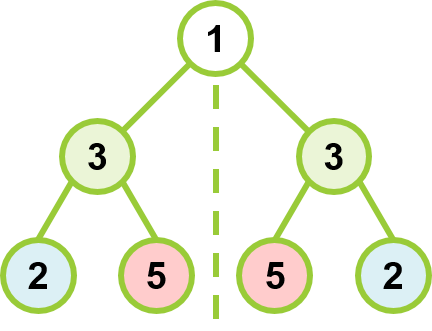
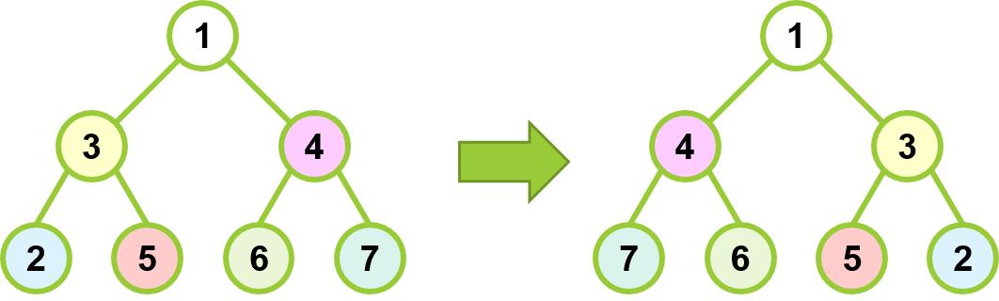

# Mirror Binary Trees

### Case1. Invert Binary Tree

Given a binary tree with root*,

return the root* of its inverted tree (left and right reversed)

* root is for a binary tree node

- Input: root = [1,3,4,2,5,6,7]
- Output: root = [1,4,3,7,6,5,2]

Task:
- try to find the inverted binary tree with the new root*
- condidering the cases for null tree, or perfect/complete binary tree

Solutions:
- C++
- depth-first search
- recursion

Time complexity: O(n)
- n as the number of binary tree nodes

Space complexity: O(1)
- no extra space

Constraints:
- 0 <= number of tree nodes <= 100
- -100 <= node.val <= 100

#
### Case2. Symmetric Tree

Given a binary tree with root,

check whether it is symmetric around its center (mirror binary tree)

- Input: root = [1,3,3,2,5,5,2]
- Output: true

Task:
- return true if the given tree is symmetric
- condidering the cases for perfect/complete binary tree

Solutions:
- C++
- depth-first search
- recursion

Time complexity: O(n)
- n as the number of binary tree nodes

Space complexity: O(1)
- no extra space

Constraints:
- 0 <= number of tree nodes <= 100
- -100 <= node.val <= 100
